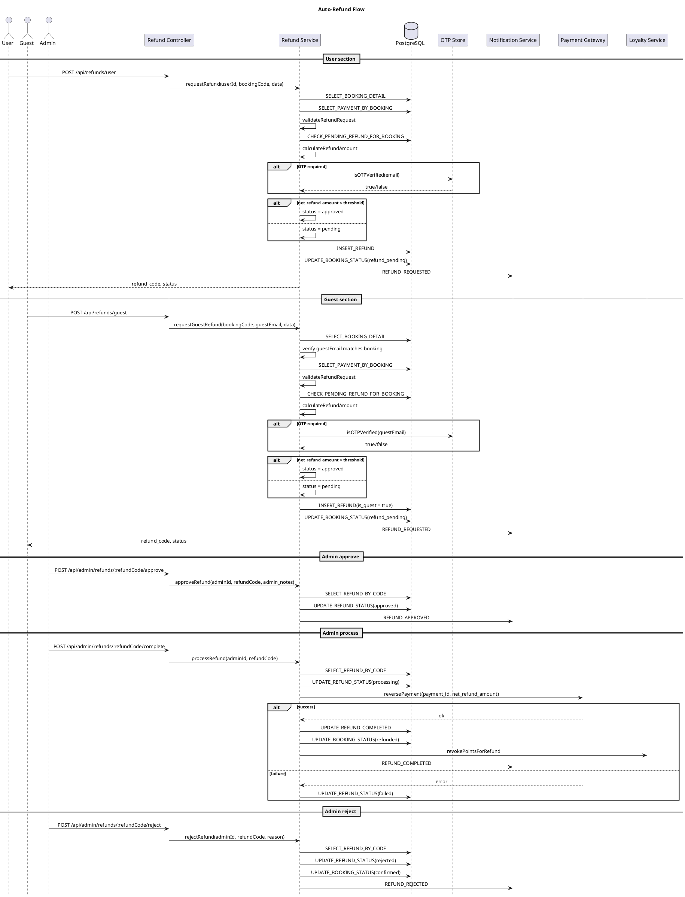

```plantuml
@startuml
hide footbox
skinparam ParticipantPadding 20
skinparam BoxPadding 10
skinparam sequenceMessageAlign center

title Auto-Refund Flow

actor User
actor Guest
actor Admin as ADMIN
participant "Refund Controller" as C
participant "Refund Service" as S
database "PostgreSQL" as DB
participant "OTP Store" as OTP
participant "Notification Service" as NOTIF
participant "Payment Gateway" as PG
participant "Loyalty Service" as LOYALTY

== User section ==
User -> C: POST /api/refunds/user
C -> S: requestRefund(userId, bookingCode, data)
S -> DB: SELECT_BOOKING_DETAIL
S -> DB: SELECT_PAYMENT_BY_BOOKING
S -> S: validateRefundRequest
S -> DB: CHECK_PENDING_REFUND_FOR_BOOKING
S -> S: calculateRefundAmount
alt OTP required
    S -> OTP: isOTPVerified(email)
    OTP --> S: true/false
end
alt net_refund_amount < threshold
    S -> S: status = approved
else
    S -> S: status = pending
end
S -> DB: INSERT_REFUND
S -> DB: UPDATE_BOOKING_STATUS(refund_pending)
S -> NOTIF: REFUND_REQUESTED
S --> User: refund_code, status

== Guest section ==
Guest -> C: POST /api/refunds/guest
C -> S: requestGuestRefund(bookingCode, guestEmail, data)
S -> DB: SELECT_BOOKING_DETAIL
S -> S: verify guestEmail matches booking
S -> DB: SELECT_PAYMENT_BY_BOOKING
S -> S: validateRefundRequest
S -> DB: CHECK_PENDING_REFUND_FOR_BOOKING
S -> S: calculateRefundAmount
alt OTP required
    S -> OTP: isOTPVerified(guestEmail)
    OTP --> S: true/false
end
alt net_refund_amount < threshold
    S -> S: status = approved
else
    S -> S: status = pending
end
S -> DB: INSERT_REFUND(is_guest = true)
S -> DB: UPDATE_BOOKING_STATUS(refund_pending)
S -> NOTIF: REFUND_REQUESTED
S --> Guest: refund_code, status

== Admin approve ==
ADMIN -> C: POST /api/admin/refunds/:refundCode/approve
C -> S: approveRefund(adminId, refundCode, admin_notes)
S -> DB: SELECT_REFUND_BY_CODE
S -> DB: UPDATE_REFUND_STATUS(approved)
S -> NOTIF: REFUND_APPROVED

== Admin process ==
ADMIN -> C: POST /api/admin/refunds/:refundCode/complete
C -> S: processRefund(adminId, refundCode)
S -> DB: SELECT_REFUND_BY_CODE
S -> DB: UPDATE_REFUND_STATUS(processing)
S -> PG: reversePayment(payment_id, net_refund_amount)
alt success
    PG --> S: ok
    S -> DB: UPDATE_REFUND_COMPLETED
    S -> DB: UPDATE_BOOKING_STATUS(refunded)
    S -> LOYALTY: revokePointsForRefund
    S -> NOTIF: REFUND_COMPLETED
else failure
    PG --> S: error
    S -> DB: UPDATE_REFUND_STATUS(failed)
end

== Admin reject ==
ADMIN -> C: POST /api/admin/refunds/:refundCode/reject
C -> S: rejectRefund(adminId, refundCode, reason)
S -> DB: SELECT_REFUND_BY_CODE
S -> DB: UPDATE_REFUND_STATUS(rejected)
S -> DB: UPDATE_BOOKING_STATUS(confirmed)
S -> NOTIF: REFUND_REJECTED

@enduml
```
