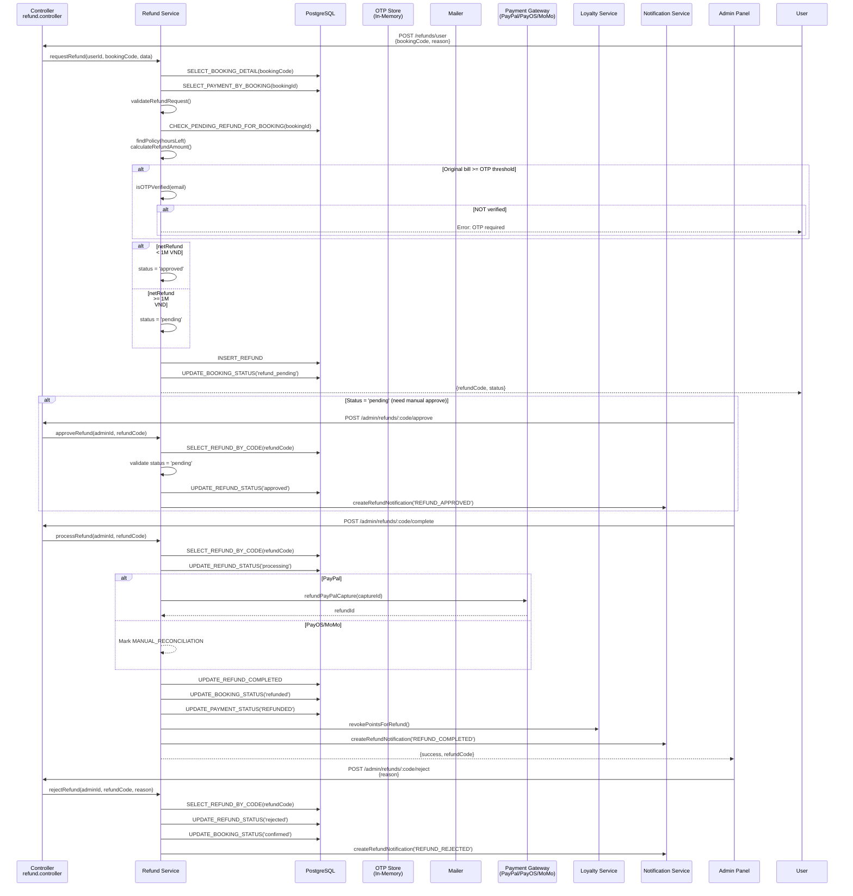
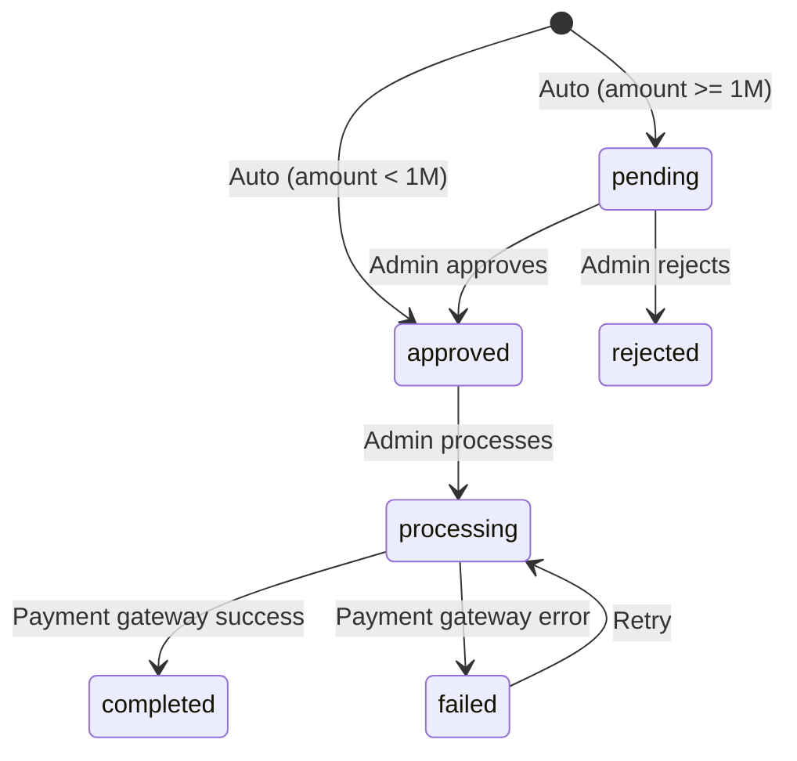

# Auto-Refund Flow - Sequence Diagram

## Status Flow

## Refund Policies

| Hours Before Departure | Refund % |
|------------------------|----------|
| > 72 hours | 100% |
| 24-72 hours | 80% |
| 12-24 hours | 50% |
| < 12 hours | 0% |
