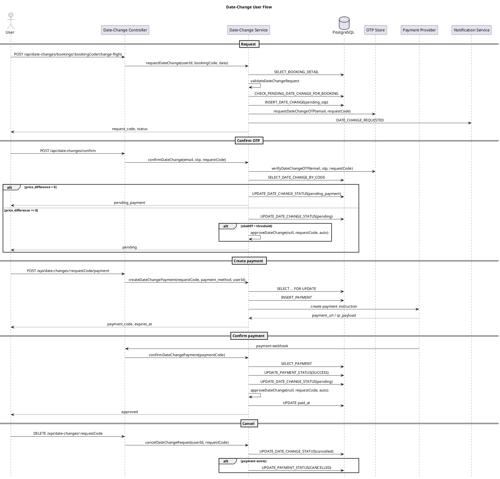

```plantuml
@startuml
hide footbox
skinparam ParticipantPadding 20
skinparam BoxPadding 10
skinparam sequenceMessageAlign center

title Date-Change User Flow

actor User
participant "Date-Change Controller" as C
participant "Date-Change Service" as S
database "PostgreSQL" as DB
participant "OTP Store" as OTP
participant "Payment Provider" as PAY
participant "Notification Service" as NOTIF

== Request ==
User -> C: POST /api/date-changes/bookings/:bookingCode/change-flight
C -> S: requestDateChange(userId, bookingCode, data)
S -> DB: SELECT_BOOKING_DETAIL
S -> S: validateDateChangeRequest
S -> DB: CHECK_PENDING_DATE_CHANGE_FOR_BOOKING
S -> DB: INSERT_DATE_CHANGE(pending_otp)
S -> OTP: requestDateChangeOTP(email, requestCode)
S -> NOTIF: DATE_CHANGE_REQUESTED
S --> User: request_code, status

== Confirm OTP ==
User -> C: POST /api/date-changes/confirm
C -> S: confirmDateChange(email, otp, requestCode)
S -> OTP: verifyDateChangeOTP(email, otp, requestCode)
S -> DB: SELECT_DATE_CHANGE_BY_CODE
alt price_difference > 0
    S -> DB: UPDATE_DATE_CHANGE_STATUS(pending_payment)
    S --> User: pending_payment
else price_difference <= 0
    S -> DB: UPDATE_DATE_CHANGE_STATUS(pending)
    alt absDiff < threshold
        S -> S: approveDateChange(null, requestCode, auto)
    end
    S --> User: pending
end

== Create payment ==
User -> C: POST /api/date-changes/:requestCode/payment
C -> S: createDateChangePayment(requestCode, payment_method, userId)
S -> DB: SELECT ... FOR UPDATE
S -> DB: INSERT_PAYMENT
S -> PAY: create payment instruction
PAY --> S: payment_url / qr_payload
S --> User: payment_code, expires_at

== Confirm payment ==
PAY -> C: payment webhook
C -> S: confirmDateChangePayment(paymentCode)
S -> DB: SELECT_PAYMENT
S -> DB: UPDATE_PAYMENT_STATUS(SUCCESS)
S -> DB: UPDATE_DATE_CHANGE_STATUS(pending)
S -> S: approveDateChange(null, requestCode, auto)
S -> DB: UPDATE paid_at
S --> User: approved

== Cancel ==
User -> C: DELETE /api/date-changes/:requestCode
C -> S: cancelDateChangeRequest(userId, requestCode)
S -> DB: UPDATE_DATE_CHANGE_STATUS(cancelled)
alt payment exists
    S -> DB: UPDATE_PAYMENT_STATUS(CANCELLED)
end

@enduml
```
