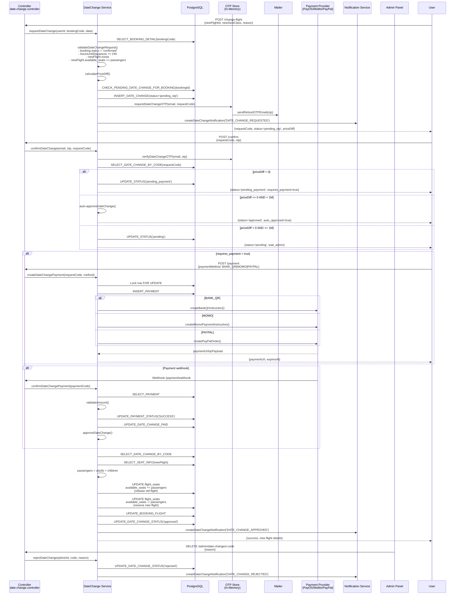
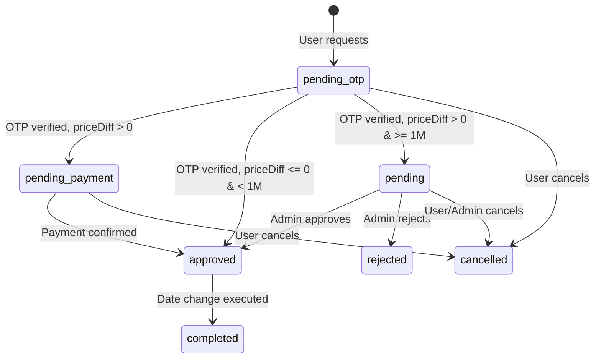

# Date-Change Flow - Sequence Diagram

## Status Flow

## Business Rules

| Rule | Value |
|------|-------|
| minHoursBeforeFlight | 24 hours |
| maxDateRange | 365 days |
| Auto-approve threshold | 1,000,000 VND |
| OTP expiry | 5 minutes |
| Payment expiry | 30 minutes |
