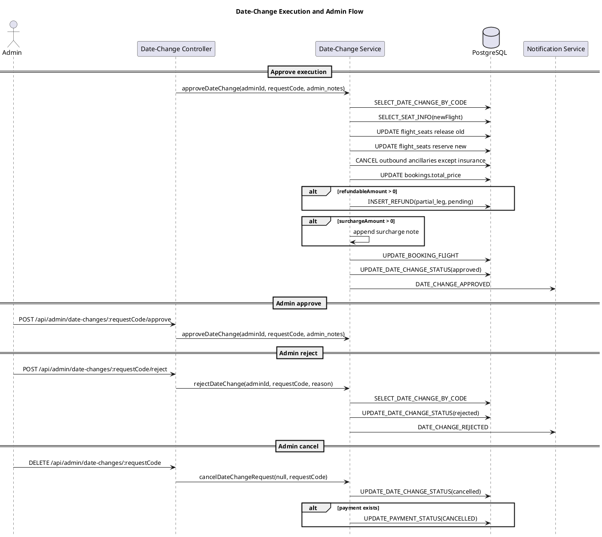

```plantuml
@startuml
hide footbox
skinparam ParticipantPadding 20
skinparam BoxPadding 10
skinparam sequenceMessageAlign center

title Date-Change Execution and Admin Flow

actor Admin as ADMIN
participant "Date-Change Controller" as C
participant "Date-Change Service" as S
database "PostgreSQL" as DB
participant "Notification Service" as NOTIF

== Approve execution ==
C -> S: approveDateChange(adminId, requestCode, admin_notes)
S -> DB: SELECT_DATE_CHANGE_BY_CODE
S -> DB: SELECT_SEAT_INFO(newFlight)
S -> DB: UPDATE flight_seats release old
S -> DB: UPDATE flight_seats reserve new
S -> DB: CANCEL outbound ancillaries except insurance
S -> DB: UPDATE bookings.total_price
alt refundableAmount > 0
    S -> DB: INSERT_REFUND(partial_leg, pending)
end
alt surchargeAmount > 0
    S -> S: append surcharge note
end
S -> DB: UPDATE_BOOKING_FLIGHT
S -> DB: UPDATE_DATE_CHANGE_STATUS(approved)
S -> NOTIF: DATE_CHANGE_APPROVED

== Admin approve ==
ADMIN -> C: POST /api/admin/date-changes/:requestCode/approve
C -> S: approveDateChange(adminId, requestCode, admin_notes)

== Admin reject ==
ADMIN -> C: POST /api/admin/date-changes/:requestCode/reject
C -> S: rejectDateChange(adminId, requestCode, reason)
S -> DB: SELECT_DATE_CHANGE_BY_CODE
S -> DB: UPDATE_DATE_CHANGE_STATUS(rejected)
S -> NOTIF: DATE_CHANGE_REJECTED

== Admin cancel ==
ADMIN -> C: DELETE /api/admin/date-changes/:requestCode
C -> S: cancelDateChangeRequest(null, requestCode)
S -> DB: UPDATE_DATE_CHANGE_STATUS(cancelled)
alt payment exists
    S -> DB: UPDATE_PAYMENT_STATUS(CANCELLED)
end

@enduml
```
