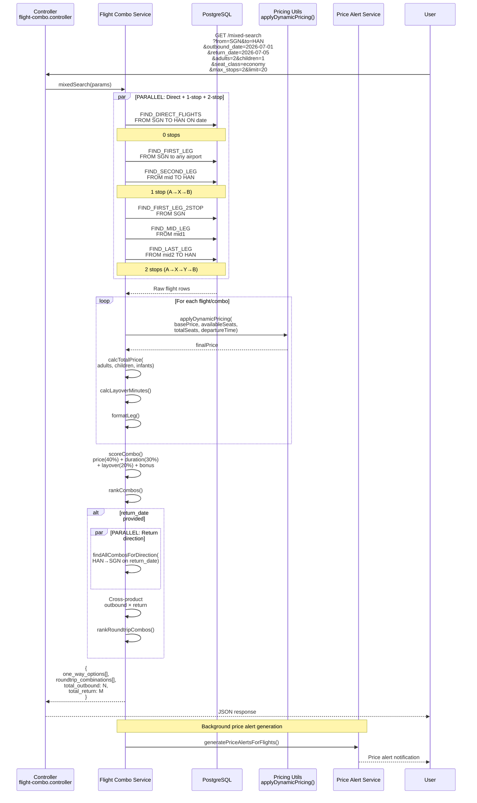
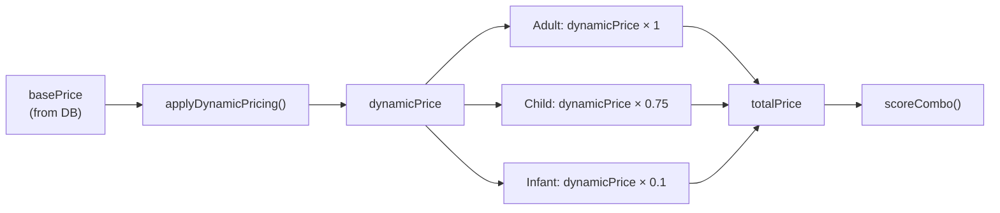
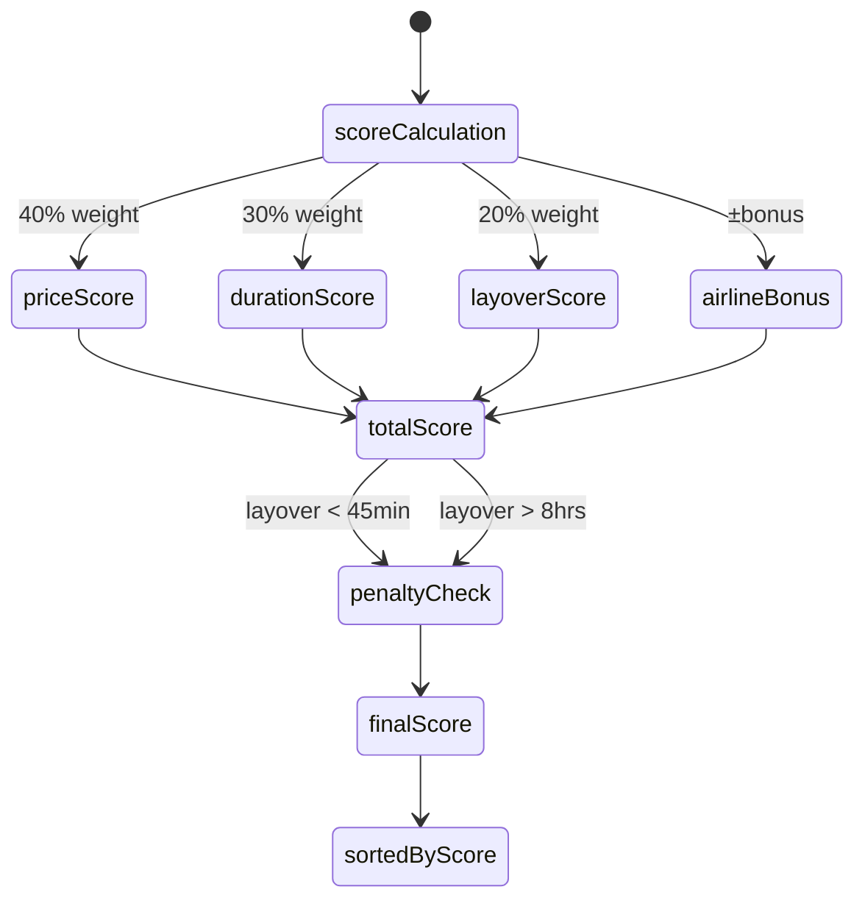

# Flight Combo Flow - Sequence Diagram

## Pricing Calculation

## Scoring Formula

## Layover Rules

| Rule | Value |
|------|-------|
| MIN_LAYOVER_MINUTES | 45 minutes |
| MAX_LAYOVER_HOURS | 8 hours |
