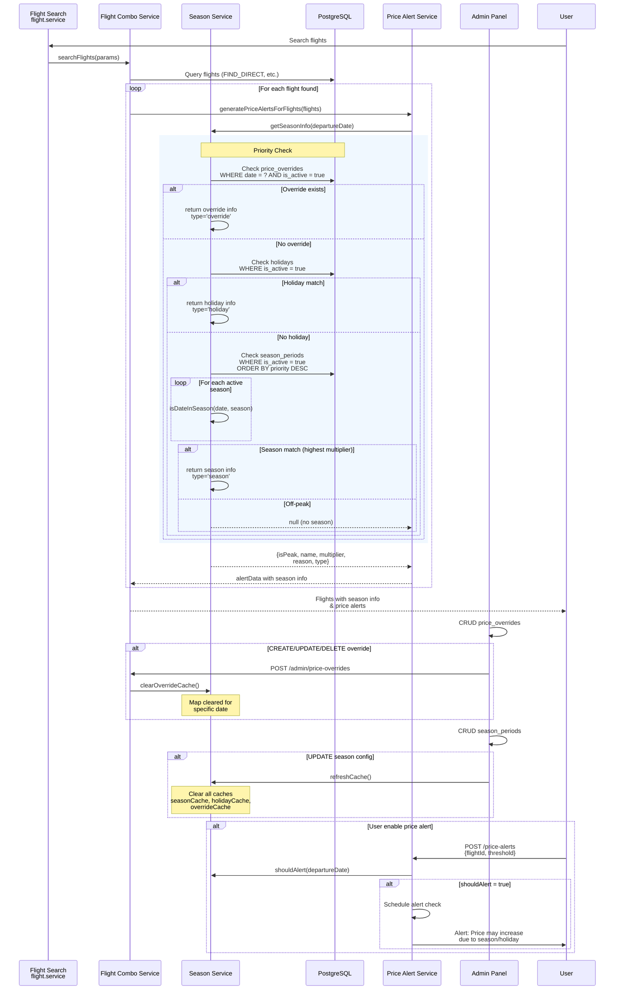
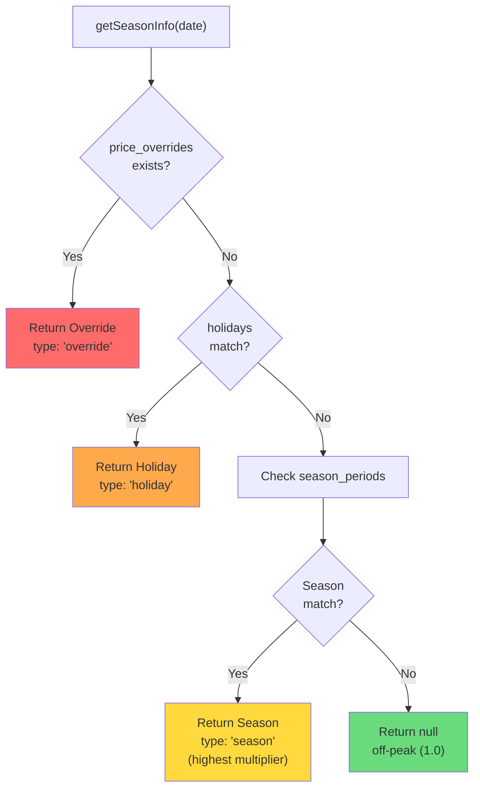
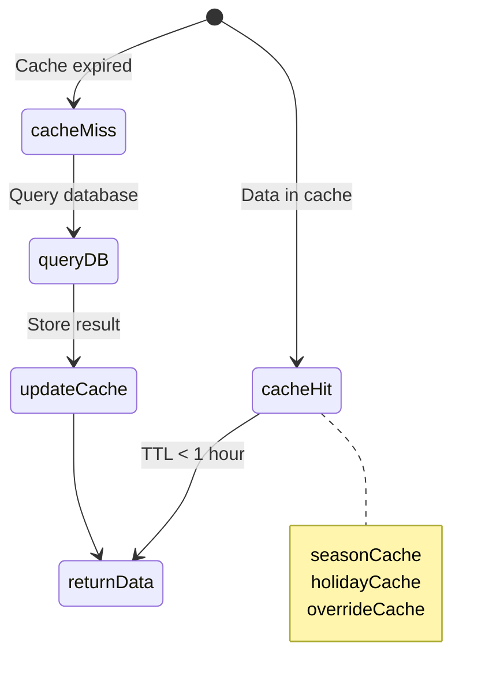
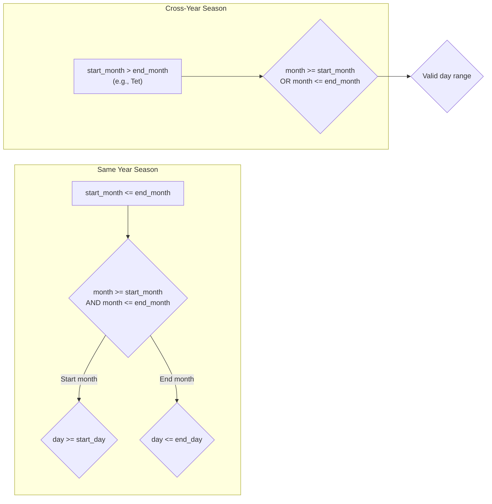

# Flight Season Pricing Flow - Sequence Diagram

## Priority Order

## Cache Strategy

## Cache Configuration

| Cache | Data | TTL | Invalidation |
|-------|------|-----|--------------|
| `seasonCache` | season_periods | 1 hour | `refreshCache()` |
| `holidayCache` | holidays | 1 hour | `refreshCache()` |
| `overrideCache` | Map<date, override> | 1 hour | `clearOverrideCache()` |

## Season Detection Logic

## Functions Reference

| Function | Purpose |
|----------|---------|
| `getActiveSeasons()` | Get all active season periods |
| `getActiveHolidays()` | Get all active holidays |
| `isDateInSeason(date, season)` | Check if date falls in season range |
| `isHoliday(date, holidays)` | Check if date is a holiday |
| `getOverrideForDate(date)` | Get admin override for specific date |
| `getSeasonInfo(date)` | Main function - returns season info |
| `getSeasonMultiplier(date)` | Returns multiplier (1.0 if off-peak) |
| `isApproachingPeakSeason(date)` | Check if approaching peak |
| `shouldAlert(date)` | Quick check for alerts |
| `clearOverrideCache()` | Invalidate override cache |
| `refreshCache()` | Invalidate all caches |
